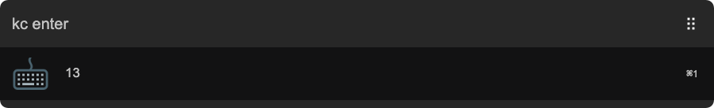

# arvis-keycode

> Get JavaScript keycode



## Install

```
$ npm install -g arvis-keycode
```

*Requires [Node.js](https://nodejs.org) 4+*


## Usage

In Arvis, type `kc`, <kbd>Enter</kbd>, and then press the requested key.

For keys like <kbd>Backspace</kbd>, <kbd>Tab</kbd>, <kbd>Ctrl</kbd> etc. type their names.


## License

MIT © [radibit](http://radibit.com)
